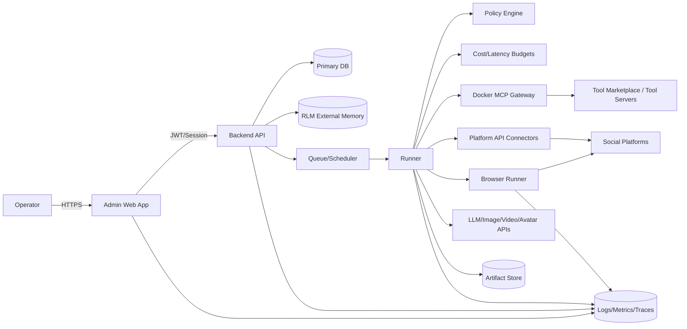
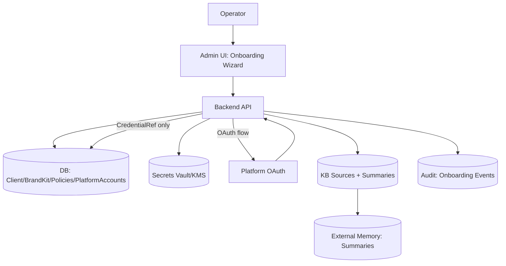
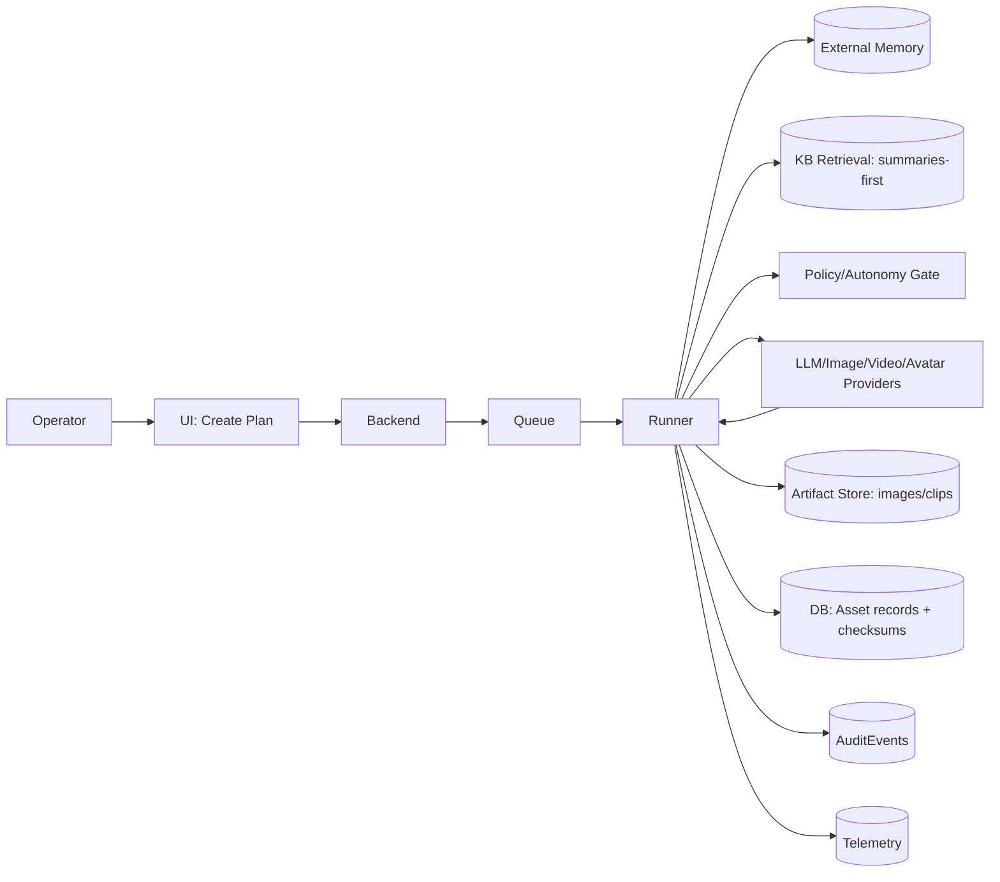
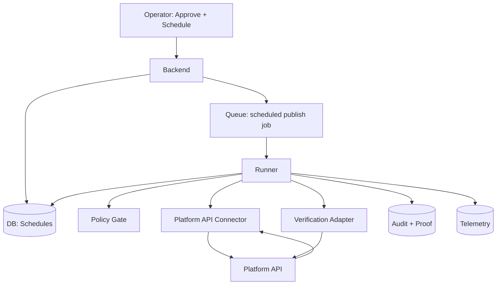
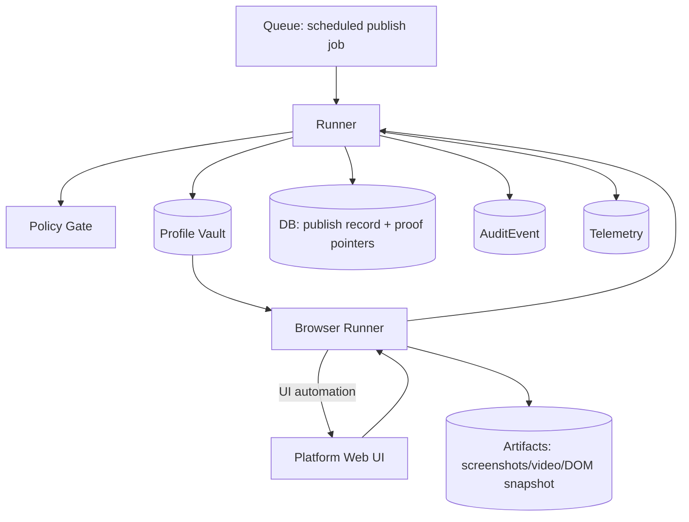
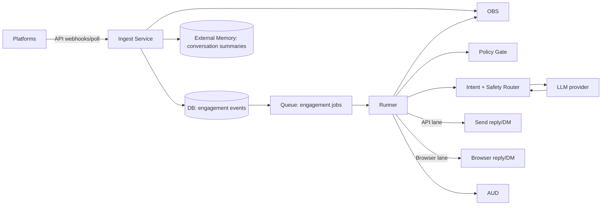

# Threat Model + Data Flow Diagrams — v1

**Project:** Raize The Vibe — Autonomous Social Media Automation Platform (Agency-Operated)

**Scope:** MVP through v1.5 (post-MVP extensibility patterns included). Covers **multi-tenant BYOK**, **Docker MCP tool gateway**, **API + Browser lanes**, and **Planning → Creation → Publishing → Engagement**.

**Primary goal:** Prevent catastrophic mistakes (wrong account, policy violations, data leaks) while keeping the system operable and fast.

---

## 1) System decomposition (what we’re modeling)

### 1.1 Core components

1) **Admin Web App (Next.js on Vercel)**
- Operator UI: onboarding, plans, approvals, schedules, engagement inbox, policies, keys (refs), diagnostics.

2) **API Layer (Backend)**
- Auth/RBAC, tenant boundary enforcement, CRUD, approvals, scheduling.

3) **Workflow Orchestrator / Runner**
- Executes episodes: planner/creator/publisher/engagement agents.
- Enforces **policy engine** + **budgets** + **recursion contracts**.

4) **Queue + Scheduler**
- Time-based job scheduling.
- Priority lanes (publish > engagement > creation > planning).

5) **External Memory / RLM Store**
- Plan graph, asset graph, conversation summaries, engagement events.
- Append-only, replayable.

6) **Tool Gateway (Docker MCP Server)**
- Single MCP endpoint for tool discovery and controlled execution.
- Scripted tool execution to keep large outputs out of agent context.

7) **Browser Automation Subsystem**
- **Profile Vault** (encrypted), **Runner** (Playwright/Puppeteer), selector maps, drift detection.

8) **Platform Integrations**
- **API lane connectors** (Meta/IG/FB, LinkedIn, X, TikTok, YouTube, etc where allowed)
- **Hybrid lane** (API + browser)
- **Skool** (high risk: typically browser lane only, often disallowed automation)

9) **Media Providers**
- LLMs (Anthropic/OpenAI/Google/OpenRouter)
- Image gen (Gemini / others)
- Video gen (Kie.ai Veo / others; silent-first clip pipeline)
- Avatar (HeyGen)

10) **Observability Stack**
- Central logs, metrics, traces (OTel), alerting, audit trail store, artifact store.

---

## 2) Trust boundaries (where to be paranoid)

Trust boundaries are the lines where data or authority crosses domains.

**TB-1:** Operator browser ↔ Admin Web App
- session, CSRF, XSS, privilege.

**TB-2:** Web App ↔ Backend API
- auth tokens, RBAC.

**TB-3:** Backend ↔ Runner/Queue
- job payload integrity, tenant scoping.

**TB-4:** Runner ↔ Tool Gateway (Docker MCP)
- tool discovery misuse, tool injection, unauthorized tool access.

**TB-5:** Runner ↔ Platform APIs
- token scopes, rate limits, content rules.

**TB-6:** Runner ↔ Browser Runner
- profile selection, session cookies, cross-tenant.

**TB-7:** System ↔ Provider APIs (LLM/image/video)
- prompt injection, secret leaks, unsafe outputs.

**TB-8:** System ↔ Artifact store (screenshots, videos)
- sensitive media leakage.

---

## 3) Crown jewels (assets to protect)

1) **Client credentials & sessions**
- OAuth tokens, refresh tokens, cookies, browser profiles, API keys (BYOK).

2) **Tenant boundary**
- `client_id` scoping and enforcement.

3) **Side-effect authority**
- ability to publish/DM/reply/like.

4) **Policy + approvals**
- autonomy settings, compliance gates.

5) **Brand kit + knowledge base**
- may contain proprietary info.

6) **Audit trail + proof artifacts**
- screenshots, URLs, message history.

7) **Tool registry + scripts**
- what the system is capable of calling.

---

## 4) Primary attacker / failure models

### 4.1 External attackers
- Credential stuffing on admin logins
- OAuth token theft
- API abuse (injection, privilege escalation)
- Artifact store scraping

### 4.2 Insider / operator mistakes
- Wrong client selected
- Keys attached to wrong tenant
- Enabling risky flags

### 4.3 Platform adversarial conditions
- UI drift/captcha
- rate limits/spam blocks
- ToS violations triggered by automation

### 4.4 Model/tool failures
- Prompt injection via comments/DMs
- Tool gateway misuse (tool discovery → dangerous tool)
- Hallucinated “success” without verification

---

## 5) Data Flow Diagrams (DFDs)

### DFD-0: High-level system

---

### DFD-1: Onboarding + BYOK + Platform connect

**Key invariants:**
- DB stores **CredentialRef** only (never raw keys).
- Tenant boundary applied to every onboarding write.
- “Connect platform” always binds tokens to the selected `PlatformAccount` + `client_id`.

---

### DFD-2: Planning → Creation (asset generation)

**Risk notes:**
- Provider outputs may include policy-violating content.
- Large provider responses must be stored externally; only summaries enter agent context.

---

### DFD-3: Publishing (API lane)

**Key invariants:**
- Publish job payload contains immutable `client_id`, `platform_account_id`, `asset_id`, `idempotency_key`.
- Verification required when possible.

---

### DFD-4: Publishing (Browser lane)

**Highest-risk area:** wrong-profile selection = wrong-account posting.

---

### DFD-5: Engagement ingest + reply/DM automation

**Key invariants:**
- Every inbound message is treated as **untrusted input**.
- Replies pass **safety + compliance + escalation router**.

---

## 6) Threat enumeration (STRIDE map)

> We use STRIDE across major components and flows. Severity assumes agency reputational + client account risk.

### 6.1 STRIDE table (MVP)

| Component / Flow | Spoofing | Tampering | Repudiation | Info Disclosure | DoS | Elevation of Privilege |
|---|---|---|---|---|---|---|
| Admin UI + API | session hijack | request/body tamper | weak audit | PII/log leakage | login flood | RBAC bypass |
| BYOK Keyring | fake key ref | ref reassignment | missing change log | key leak via logs | vault exhaustion | access to other tenant refs |
| Runner + Queue | fake job payload | payload edit | missing job trace | job data leak | backlog | execute privileged job |
| Tool Gateway | tool spoof | tool script tamper | missing tool call logs | exfil via tools | tool overload | access forbidden tools |
| Browser Vault/Runner | wrong profile | selector map tamper | missing proof | cookie/session leak | captcha loop | cross-tenant profile access |
| Platform API Connectors | token spoof | request tamper | missing post IDs | token leak | rate limit | use wider scopes |
| Engagement Router | fake user | prompt injection | missing convo log | leakage to model | spam storm | autonomy override |
| Artifact Store | unsigned URLs | tamper proof | missing chain | public link leak | storage flood | access other tenant artifacts |

---

## 7) Top threats (ranked) + required mitigations

### T1) Wrong-account side effect (P0)
**Scenario:** Browser runner selects wrong Chrome profile or wrong OAuth token; posts/DMs on wrong client.

**Required mitigations (MVP):**
- Hard **tenant+account assertion** before every side effect
- Dual-identity check: `client_id` + `platform_account_id` must match profile/token fingerprint
- Browser lane: per-profile signed manifest (hash of expected account identifiers)
- “Two-man rule” for enabling new browser profiles to side-effect mode
- Global/per-client kill switch always available

### T2) Prompt injection via comments/DMs leading to tool misuse
**Scenario:** Inbound message instructs agent to reveal secrets or call tools.

**Mitigations:**
- Treat inbound text as **data**, not instructions
- Strict tool allowlist per task class
- Content firewall: remove/escape system-instruction patterns
- Enforced response templates for engagement
- Escalation rules for sensitive intents (pricing/refunds/legal)

### T3) Credential leakage (BYOK, cookies, tokens)
**Mitigations:**
- Secrets never stored raw in DB
- Redaction middleware for logs + traces
- Artifact scrubbing for screenshots (mask emails/phones when possible)
- Least-privileged OAuth scopes
- Rotation playbook + breach playbook

### T4) Tool gateway becomes an exfiltration vector
**Mitigations:**
- Tool registry is signed + versioned
- Per-tenant tool permission map
- Script executor sandboxing
- Egress restrictions (deny unknown domains)
- Record tool call digests + outputs to artifacts, not LLM context

### T5) Spam/restriction events due to automation cadence
**Mitigations:**
- Global caps per platform/action/day
- Adaptive pacing + jitter
- Cooldowns on repeated triggers
- Human-review mode on spikes

### T6) Artifact store leakage / link sharing
**Mitigations:**
- Private bucket, signed URLs with short TTL
- Tenant-scoped pathing
- Access logs + anomaly detection

### T7) Telemetry captures sensitive data
**Mitigations:**
- Sensitive fields allowlist
- PII scrubbing
- Trace context sanitization

---

## 8) Security requirements (implementation rules)

### 8.1 Identity & access
- RBAC: operator roles (Admin, Manager, Publisher, Reviewer, Analyst)
- All mutations require tenant scoping
- Privileged actions: enabling side-effect automation requires elevated permission

### 8.2 Tenant isolation
- Every DB table keyed by `client_id`
- Query-level enforcement + application-level enforcement
- Background jobs carry immutable tenant context

### 8.3 Secrets handling
- Vault/KMS integration
- CredentialRefs only
- No secrets in logs, traces, prompt context

### 8.4 Side-effect gating
- Policy evaluation executes before any tool call
- Approval gating for risky actions
- Idempotency keys for all side effects

### 8.5 Browser lane safety
- Profile vault encryption
- Profile manifest signing
- Selectors versioned per platform
- Drift detection triggers read-only mode

### 8.6 Tool gateway safety
- Allowlist tools per agent role
- Script executor runs in sandbox
- Outputs stored externally; only summaries flow back

---

## 9) Security test plan linkage (how we verify)

Minimum verification set per release:
- Unit tests: tenant guard, policy engine, routing, idempotency
- Integration tests: queue job scoping, tool gateway permissions, artifact store access
- E2E: sandbox client publishes + verifies + engagement replies
- Chaos tests: provider outage, rate limit simulation, browser selector drift

---

## 10) Post-MVP extensibility patterns (defined now)

This threat model anticipates v2+ by including:

1) **Provider marketplace (BYOK expansions):**
- new providers must implement: secret refs, quota caps, redaction compliance.

2) **Client dashboards / limited client logins:**
- introduce “client viewer/reviewer” roles with strict separation.

3) **Metrics + experiment layer:**
- additional privacy considerations, event minimization, retention policies.

4) **Multi-workspace agency support:**
- agency-level tenancy above client tenancy (two-level isolation).

---

## 11) Open questions (must be decided in ADRs)

1) Primary auth method for operators (SSO, passwordless, etc.)
2) Vault provider (managed vs self-hosted)
3) Queue tech (managed vs self-hosted)
4) Artifact storage provider + retention
5) Browser runner hosting model (local vs remote)

---

## 12) Next doc

**ADR Index + Templates — v1**

